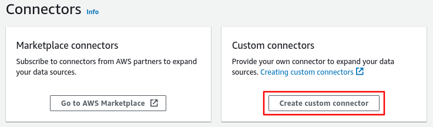
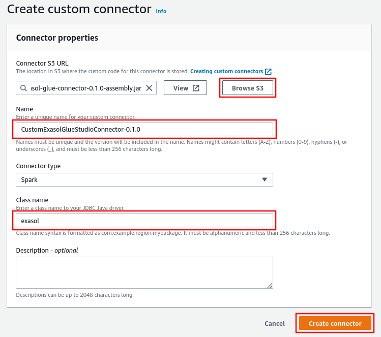

# Developers Guide

This guide contains information for developers.

## Available Dependencies in AWS Glue

See [AWS Glue versions](https://docs.aws.amazon.com/glue/latest/dg/release-notes.html) and the [Migration guide](https://docs.aws.amazon.com/glue/latest/dg/migrating-version-30.html) for a list of provided dependencies and their versions.

## Publishing the Connector to AWS Marketplace

Once the release pushes new connector image to the AWS ECR Registry, you'll have to manually publish the new version.

Ensure that the docker image with new release tag is pushed to AWS ECR registry:

```sh
aws ecr describe-images --registry-id $MARKETPLACE_ECR_ACCOUNT_ID --repository-name $MARKETPLACE_ECR_REPO_NAME --region us-east-1
```

Login to Amazon AWS account and follow the instructions below:

- Go to Exasol [AWS Marketplace Portal](https://aws.amazon.com/marketplace/management/homepage) (this is main `exasol` account)
- Go to Products &rarr; Server &rarr; "Exasol Connector for AWS Glue"
- Click on "Request changes" and select "Add new version"
- Add new version and for the "Release notes" copy the content of changes markdown file for that version
- Click on "Activate in AWS Glue Studio" on the Delivery Options section
- On the "Container image" field, update the **version** at the end of the image
- On the "Usage instructions" field, update the **version** on the `connectorUrl` and `connectorVersion` properties
- Only select `Amazon Elastic Container Service (ECS)` on "Supported Services"
- Click Next

On the next "Restrict version" section, select "No" so that previous version still remain visible to users, and click next.

Finally, review all the changes and submit the request.

## Creating Custom Connector

AWS Glue Studio allows to create a custom connectors. It can be useful to debug the connector.

To test connector by creating a custom connector, please follow these steps.

### Creating an Assembly Jar

By running `mvn verify` or `mvn package` create a connector artifact. For example, `target/exasol-glue-connector-2.1.1-assembly.jar`.

### Uploading the Artifact to S3 Bucket

Upload the JAR artifact from previous step into an S3 bucket. For instance, `s3://exasol-artifacts/glue-connector/exasol-glue-connector-2.1.1-assembly.jar`.

### Creating a Glue Studio Custom Connector

Go to AWS Glue Studio, and click on "Connectors" &rarr; "Create Custom Connector".



Then select `Spark` as "Connection type" from drop-down list and fill other necessary fields.

- "Browse S3" and select the uploaded JAR artifact from previous step
- Enter unique and descriptive name for the connector
- Enter `exasol` as "Class name"
- And click on the "Create connector" button



Now create a connection for your custom connector.

- Go to Connectors and select your custom connector
- Click on "Create connection" button on top-right corner
- Give a unique name for the connection
- Finally click "Create connection" button

### Creating a Job

Now you can follow from the [user guide - creating a job](../user_guide/user_guide.md#creating-a-job) section.
