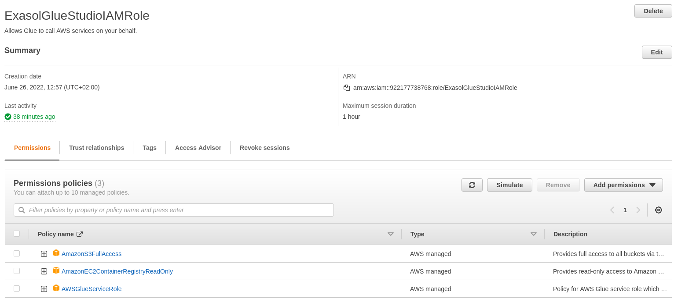
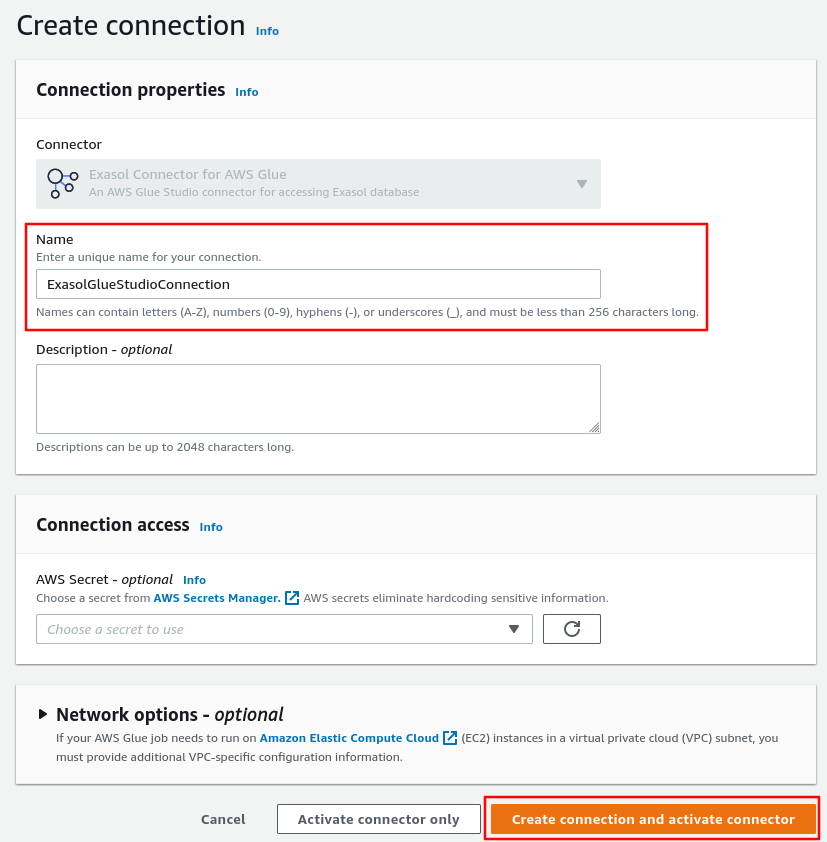
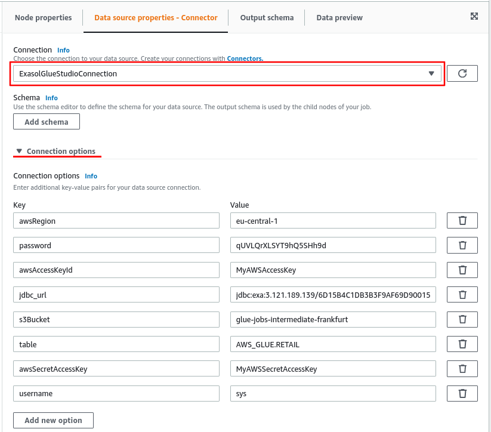

# Exasol AWS Glue Connector User Guide

## Table of Contents

- [Preparing Required Services](#preparing-required-services)
- [Setting up the Connector](#setting-up-the-connector)
- [Job Parameters](#job-parameters)
- [Data Mapping](#data-mapping)

## Preparing Required Services

To use the AWS Glue Studio connector, you should prepare the following steps which then will be used setting up the connector.

### Creating IAM Role

We are going to create an IAM Policy Role with required permissions that will act on our behalf when using AWS Glue Studio Connector. Go to ["IAM Service"](https://console.aws.amazon.com/iam/) &rarr; from navigation page choose "Roles" &rarr; click "Create Role" on the top right corner. Please follow these steps:

- Ensure that "AWS service" is selected
- For "Use cases for other AWS services" search for "Glue" and select "Glue"
- Click "Next" to add permissions
- Type "S3" to Filter Policies and press enter, and then select `AmazonS3FullAccess` policy
- Type "Glue" and press enter, and then select `AWSGlueServiceRole` policy
- Similarly, search for and add `AmazonEC2ContainerRegistryReadOnly` policy
- These are the default policy roles, however, please change them accordingly
- Then click next, and provide a descriptive Role name and Role description
- Add tags, review and click "Create role" button

Please read about the AWS Glue Studio [documentation on minimum required permissions](https://docs.aws.amazon.com/glue/latest/ug/setting-up.html#getting-started-min-privs-connectors).

## Setting up the Connector

To setup the connector you will first need to login to your AWS account. Then, go to the Exasol AWS Glue Studio [connector marketplace](https://aws.amazon.com/marketplace/pp/prodview-2mlebkenfsg7o) page, and click on "Continue to Subscribe" button.

Once you accepted the terms and conditions, click on "Usage" tab, go to "View usage instructions" and click to "Activate the Glue connector from AWS Glue Studio" link.

### Creating a Connection

It will bring you into AWS Glue Studio service. Please add a unique connection name.

Then click "Create Connection and Activate Connector" button.

#### Confirm That Connector and Connection are Created

To confirm that the connector is activated and the corresponding connection is created, go to "AWS Glue Studio" &rarr; "Connectors". You should see the connector and connection are created as in following images.

### Creating a Job

Let's now create a AWS Glue Studio Job that accesses Exasol database. Go to "AWS Glue Studio" &rarr; "Jobs", select "Visual with a blank canvas" and click on the "Create" button.

This creates a black canvas. From the "Source" dropdown menu select the "Exasol Connector for AWS Glue" and from the "Target" drowdown menu select "Amazon S3". This way, we are creating a simple job that will read from Exasol database and store the results into an S3 location.

#### Update Source Parameters

We can now setup our source node parameters. Click on the "Data Source", for the connection select the "Connection Name" we created earlier. Then, click on "Connection options" &rarr; "Add new option", and add required key value parameters. You can read about them on [Job Parameters](#job-parameters) section.

Similarly, select a target node and provide a S3 bucket location for storing the data.

Finally, give a descriptive name for the job and save it.

### Updating Job Details

Now you can configure our job. Go to "Job details" and provide or update settings. For "IAM Role", select the IAM Role you created earlier.

You can also choose the Glue version; however, we recommend that you choose the latest version of Glue 3.0 runtime. Additionally, you can set the language type, "Scala" or "Python", and other configurations such as "Number of retries" or "Job timeout".

### Running Job

Now you can run the job, please click on "Run" button. Similarly, you can setup schedules to run the job.

## Job Parameters

The following table shows required or optional parameters for running AWS Glue Studio Jobs.

| Parameter             | Default            | Required | Example                                         |
|-----------------------|:------------------:|:--------:|-------------------------------------------------|
| `jdbc_url`            |                    |    ✓     | `jdbc:exa:10.0.0.11/fingerprint:8563`           |
| `username`            |                    |    ✓     | `sys`                                           |
| `password`            |                    |    ✓     | `3wcyPtZuYX7p4gTeyJyv`                          |
| `awsAccessKeyId`      |                    |    ✓     | `AKIA5NZSQR...`                                 |
| `awsSecretAccessKey`  |                    |    ✓     | `cwkpgmTwtEZh0SC...`                            |
| `s3Bucket`            |                    |    ✓     | `exasol-retail-frankfurt`                       |
| `table`               |                    |          | `AWS_GLUE.RETAIL`                               |
| `query`               |                    |          | `SELECT product_id, price FROM AWS_GLUE.RETAIL` |
| `numPartitions`       | `8`                |          | `16`                                            |
| `awsRegion`           | `us-east-1`        |          | `eu-central-1`                                  |
| `awsEndpointOverride` | `default endpoint` |          | `s3.custom-endpoint.com`                        |
| `s3PathStyleAccess`   | `false`            |          | `true`                                          |
| `useSsl`              | `true`             |          | `false`                                         |

Either one of `table` or `query` parameters should be provided when reading data from Exasol database.

## Data Mapping

This section shows how Exasol data types are mapped to Spark data types.

You can checkout [data types overview](https://docs.exasol.com/sql_references/data_types/datatypesoverview.htm) documentation for information on Exasol data types. Similarly [support data types](https://spark.apache.org/docs/latest/sql-ref-datatypes.html) documentation for more information on Spark types.

The following table shows the mapping of Exasol base types to Spark types:

| Exasol Column Type | Spark Field Type    |
|:-------------------|:--------------------|
| `BOOLEAN`          | `BooleanType`       |
| `CHAR(n)`          | `StringType`        |
| `VARCHAR(n)`       | `StringType`        |
| `DECIMAL(p, s)`    | `DecimalType(p, s)` |
| `DOUBLE PRECISION` | `DoubleType`        |
| `DATE`             | `DateType`          |
| `TIMESTAMP`        | `TimestampType`     |

The following Exasol types are not supported at the moment:

- `GEOMETRY[(srid)]`
- `HASHTYPE[(n BYTE | m BIT)]`
- `TIMESTAMP WITH LOCAL TIME ZONE`
- `INTERVAL YEAR [(p)] TO MONTH`
- `INTERVAL DAY [(p)] TO SECOND [(fp)]`

Exasol offers type aliases. These types don't change functionality and use one of the base type underneath. For example, type alias `BIGINT` is equal to the base type `DECIMAL(36, 0)`. Alias types in Exasol provide compatibility with other third-party products.

The following table shows the mapping of the Exasol alias types to Spark types:

| Exasol Column Type          | Exasol Base Type   | Spark Field Type     |
|:----------------------------|:-------------------|:---------------------|
| `BOOL`                      | `BOOLEAN`          | `BooleanType`        |
| `CHAR`                      | `CHAR(1)`          | `StringType`         |
| `CHAR VARYING(n)`           | `VARCHAR(n)`       | `StringType`         |
| `CHARACTER`                 | `CHAR(1)`          | `StringType`         |
| `CHARACTER VARYING(n)`      | `VARCHAR(n)`       | `StringType`         |
| `CHARACTER LARGE OBJECT`    | `VARCHAR(2000000)` | `StringType`         |
| `CHARACTER LARGE OBJECT(n)` | `VARCHAR(n)`       | `StringType`         |
| `CLOB`                      | `VARCHAR(2000000)` | `StringType`         |
| `CLOB(n)`                   | `VARCHAR(n)`       | `StringType`         |
| `DEC`                       | `DECIMAL(18, 0)`   | `DecimalType`        |
| `DEC(p)`                    | `DECIMAL(p, 0)`    | `DecimalType(p, 0)`  |
| `DEC(p, s)`                 | `DECIMAL(p, s)`    | `DecimalType(p, s)`  |
| `DECIMAL`                   | `DECIMAL(18, 0)`   | `DecimalType(18, 0)` |
| `DECIMAL(p)`                | `DECIMAL(p, 0)`    | `DecimalType(p, 0)`  |
| `DOUBLE`                    | `DOUBLE PRECISION` | `DoubleType`         |
| `FLOAT`                     | `DOUBLE PRECISION` | `DoubleType`         |
| `REAL`                      | `DOUBLE PRECISION` | `DoubleType`         |
| `BIGINT`                    | `DECIMAL(36, 0)`   | `DecimalType`        |
| `INT`                       | `DECIMAL(18, 0)`   | `LongType`           |
| `INTEGER`                   | `DECIMAL(18, 0)`   | `LongType`           |
| `SHORTINT`                  | `DECIMAL(9, 0)`    | `IntegerType`        |
| `SMALLINT`                  | `DECIMAL(9, 0)`    | `IntegerType`        |
| `TINYINT`                   | `DECIMAL(3, 0)`    | `ShortType`          |
| `LONG VARCHAR`              | `VARCHAR(2000000)` | `StringType`         |
| `NCHAR(n)`                  | `CHAR(n)`          | `StringType`         |
| `NVARCHAR(n)`               | `VARCHAR(n)`       | `StringType`         |
| `NVARCHAR2(n)`              | `VARCHAR(n)`       | `StringType`         |
| `VARCHAR2(n)`               | `VARCHAR(n)`       | `StringType`         |
| `NUMBER`                    | `DOUBLE PRECISION` | `DoubleType`         |
| `NUMBER(p)`                 | `DECIMAL(p, 0)`    | `DecimalType`        |
| `NUMBER(p, s)`              | `DECIMAL(p, s)`    | `DecimalType`        |
| `NUMERIC`                   | `DECIMAL(18, 0)`   | `DecimalType`        |
| `NUMERIC(p)`                | `DECIMAL(p, 0)`    | `DecimalType`        |
| `NUMERIC(p, s)`             | `DECIMAL(p, s)`    | `DecimalType`        |

The following Exasol alias types are not supported at the moment:

| Exasol Column Type | Exasol Base Type     |
|:-------------------|:---------------------|
| `HASHTYPE`         | `HASHTYPE (16 BYTE)` |
